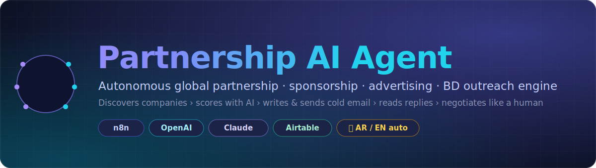
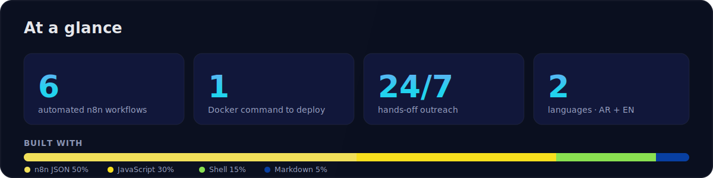
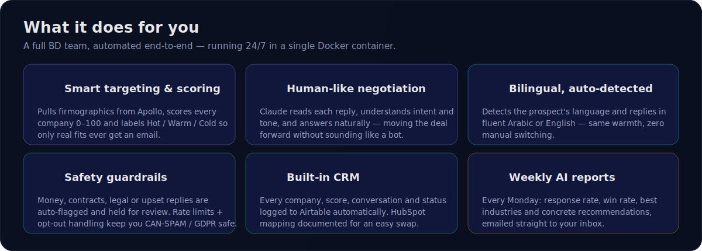
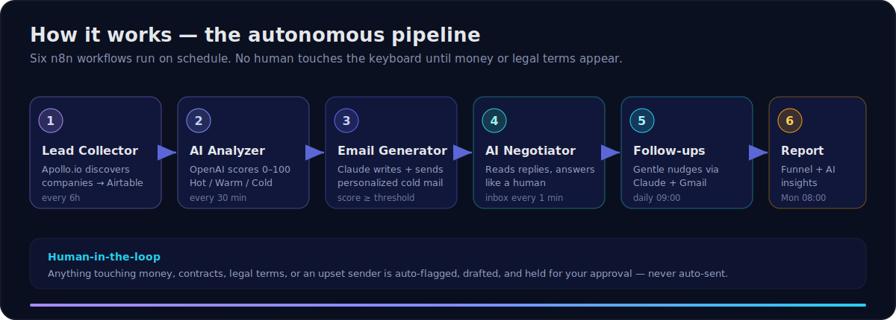
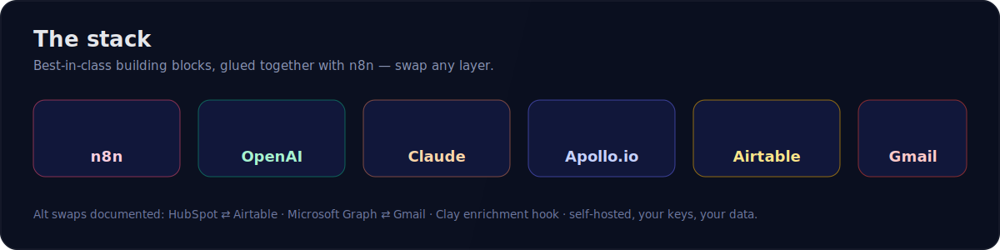

<div align="center">



<br/>

<!-- ░░░ language / tech box ░░░ -->
<p>
  <a href="#"></a>
  <a href="#"></a>
  <a href="#"></a>
  <a href="#"></a>
</p>
<p>
  
  
  
  
  
  
</p>
<p>
  
  
  
  
  
</p>

</div>

---

## ℹ️ What is this?

**Partnership AI Agent** is an autonomous, end-to-end **partnership · sponsorship · advertising · BD** outreach engine.
It does the whole top-of-funnel job a business-development team does — without you touching the keyboard:

1. **Discovers** companies that fit your offer (Apollo.io).
2. **Analyzes & scores** each one 0–100 with AI, labeling them Hot / Warm / Cold (OpenAI).
3. **Writes & sends** a personalized cold email to every good fit (Anthropic Claude → Gmail).
4. **Reads replies and answers like a human**, negotiating the deal in **Arabic or English (auto-detected)**.
5. **Follows up** politely on silence, and **logs everything to a CRM** (Airtable).
6. **Emails you a weekly performance report** with AI insights and recommendations.

It runs as **six n8n workflows inside a single Docker container** — `docker compose up -d` and it's live.
**Human stays in the loop:** anything about money, contracts, legal terms, or an upset sender is auto-flagged, drafted, and held for your approval — never auto-sent.

<div align="center"></div>

---

## ✨ Features

<div align="center"></div>

---

## 🔄 How it works

<div align="center"></div>

```
Company Sources (Apollo / Clay)
        │
        ▼
1. Lead Collector ........ n8n + Apollo.io  ──►  Airtable (Companies)
        ▼
2. AI Analyzer + Scoring . OpenAI            ──►  Lead Score 0-100 + Hot/Warm/Cold
        ▼
3. Email Generator ....... Anthropic Claude  ──►  personalized cold email
        ▼
   Email Sender .......... Gmail API
        ▼
4. Reply Reader .......... Gmail Trigger
        ▼
   AI Negotiator ......... Anthropic Claude  ──►  human-like reply, auto-sent
        ▼                                         (flagged for review if money/legal)
5. Follow-up System ...... Claude + Gmail
        ▼
   CRM Database .......... Airtable  (HubSpot mapping documented)
        ▼
6. Performance Report .... Claude            ──►  weekly funnel + insights email
```

---

## 🧰 Tech stack

<div align="center"></div>

| Layer | Tool |
|---|---|
| Automation | **n8n** (self-hosted via Docker) |
| Analysis & scoring | **OpenAI** (`gpt-4o-mini`) |
| Email writing & negotiation | **Anthropic Claude** (`claude-sonnet-4-6`) |
| Lead sourcing | **Apollo.io** (+ Clay enrichment hook) |
| CRM | **Airtable** (primary) · HubSpot (alt, see `db/airtable-schema.md`) |
| Email | **Gmail API** (primary) · Microsoft Graph (alt) |

---

## 📁 Repository layout

```
partnership-ai-agent/
├── docker-compose.yml          # runs n8n
├── .env.example                # all keys + outreach guardrails
├── assets/                     # README graphics (SVG)
├── workflows/                  # import these into n8n (in order)
│   ├── 1_lead_collection.json
│   ├── 2_ai_analysis_scoring.json
│   ├── 3_outreach_sender.json
│   ├── 4_reply_reader_negotiator.json
│   ├── 5_followups.json
│   └── 6_performance_report.json
├── prompts/                    # editable AI system prompts (reference)
├── db/airtable-schema.md       # CRM schema + HubSpot mapping
├── scripts/setup_airtable.mjs  # auto-creates the Airtable tables
├── scripts/start.sh            # convenience launcher
└── data/seed_companies.csv     # optional manual seed list
```

---

## 🚀 Setup (≈15 min)

### 1. Configure env
```bash
cp .env.example .env
openssl rand -hex 32        # paste into N8N_ENCRYPTION_KEY
# fill in OPENAI_API_KEY, ANTHROPIC_API_KEY, APOLLO_API_KEY,
# AIRTABLE_API_KEY, AIRTABLE_BASE_ID, and the ORG_* identity fields.
```

### 2. Create the Airtable CRM
- Create an empty base in Airtable, copy its `appXXXX` id into `AIRTABLE_BASE_ID`.
- Create a Personal Access Token (scopes: `data.records:read/write`, `schema.bases:read/write`) → `AIRTABLE_API_KEY`.
- Auto-create the tables:
  ```bash
  AIRTABLE_API_KEY=pat... AIRTABLE_BASE_ID=app... node scripts/setup_airtable.mjs
  ```
- In the Airtable UI, add a **`Company`** field on `Conversations` of type *Link to another record → Companies* (the only field the API can't create in one pass). Reference: `db/airtable-schema.md`.

### 3. Start n8n with Docker 🐳
```bash
docker compose up -d
# open http://localhost:5678  (login = N8N_USER / N8N_PASSWORD)
```

### 4. Create credentials inside n8n (Settings → Credentials)
| Credential (exact type) | Used by | What to enter |
|---|---|---|
| **OpenAI** (`openAiApi`) | analysis | OpenAI key |
| **Anthropic** (`anthropicApi`) | email/negotiation | Anthropic key |
| **Airtable Personal Access Token** (`airtableTokenApi`) | all CRM | the PAT |
| **Header Auth** named `Apollo API (X-Api-Key)` | lead collection | Header **Name** `X-Api-Key`, **Value** = your Apollo key |
| **Gmail OAuth2** (`gmailOAuth2`) | send/read | Google OAuth client |

### 5. Import workflows
n8n → *Workflows → Import from File* → import all six in `workflows/`.
Open each node showing a credential warning and pick the matching credential you just created (the JSON references them by name, so most map automatically).

### 6. Go live
Activate workflows **in order**: 1 → 2 → 3 → 4 → 5 → 6.
- **WF1** fills Companies every 6h (or hit the webhook `POST /webhook/add-leads`).
- **WF2** analyzes & scores every 30 min.
- **WF3** emails every lead scoring ≥ `MIN_SCORE_TO_SEND` (default 70), capped at `MAX_SEND_PER_RUN` per run.
- **WF4** watches the inbox every minute and auto-replies like a human.
- **WF5** sends gentle follow-ups daily at 09:00.
- **WF6** emails you a funnel-metrics + AI-insights report every Monday 08:00.

---

## 🛡️ Safety / human-in-the-loop
- **Nothing is sent below the score threshold.** Tune `MIN_SCORE_TO_SEND`.
- The negotiator **auto-flags** any reply involving money, contracts, legal terms, or an upset sender: it drafts the response, sets the company to `Negotiating`, saves the draft in **Notes**, and does **not** auto-send — you send those yourself.
- Start conservative: set `MAX_SEND_PER_RUN=3` and test with one seed company before scaling. Respect anti-spam law (CAN-SPAM / GDPR): only contact legitimate business addresses and honor opt-outs (`Status = Do Not Contact`).

---

## 🎯 Customizing the pitch
Everything about *who you are* lives in `.env` (`ORG_NAME`, `ORG_ONE_LINER`, `ORG_VALUE_PROP`, `SENDER_*`). Change targeting keywords/titles in WF1's **Search Params** node. Tone & rules live in the `prompts/` files and inside the AI nodes of WF2–WF5.

## 🔀 Swap options
- **HubSpot instead of Airtable** → replace the Airtable HTTP nodes with HubSpot nodes; field mapping in `db/airtable-schema.md`.
- **Microsoft Graph instead of Gmail** → swap the Gmail nodes for "Microsoft Outlook" nodes and set `MS_GRAPH_*`.
- **Clay enrichment** → set `CLAY_WEBHOOK_URL` and POST new companies to it between WF1 and WF2 for deeper firmographics before scoring.

---

<div align="center">

**Built with n8n · OpenAI · Claude · Apollo · Airtable · Gmail**
Self-hosted · your keys · your data.

</div>
